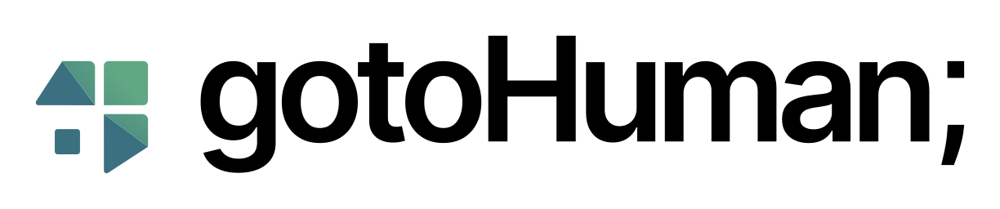

<div align="center">



</div>

# gotoHuman MCP Server

gotoHuman makes it easy to add **human approvals** to AI agents and agentic workflows.  
A fully-managed async human-in-the-loop workflow with a customizable approval UI.  
Enjoy built-in auth, webhooks, notifications, team features, and an evolving training dataset.

Use our MCP server to request human approvals from your AI workflows or use it to help with integration.

## Usage

Available on npm as:

```bash
@gotohuman/mcp-server
```

### Setup in Cursor / Claude / etc.

```json
{
  "mcpServers": {
    "gotoHuman": {
      "command": "npx",
      "args": ["-y", "@gotohuman/mcp-server"],
      "env": {
        "GOTOHUMAN_API_KEY": "your-api-key"
      }
    }
  }
}
```

[](cursor://anysphere.cursor-deeplink/mcp/install?name=gotoHuman&config=eyJjb21tYW5kIjoibnB4IC15IEBnb3RvaHVtYW4vbWNwLXNlcnZlciIsImVudiI6eyJHT1RPSFVNQU5fQVBJX0tFWSI6InlvdXItYXBpLWtleSJ9fQ==)

Get your API key and set up an approval step at [app.gotohuman.com](https://app.gotohuman.com)

## Tools

### `list-forms`
List all available review types.
  - __Returns__ a list of all available review types in your account incl. high-level info about the added fields
### `get-form-schema`  
Get the schema to use when requesting a human review for a given review type.
  - __Params__
    - `formId`: The review type ID to fetch the schema for
  - __Returns__ the schema, considering the incl. fields and their configuration
### `request-human-review-with-form`  
Request a human review. Will appear in your gotoHuman inbox.
  - __Params__
    - `formId`: The ID of the review type to use
    - `fieldData`: Content (AI-output to review, context,...) and configuration for the review type's fields.  
    The schema for this needs to be fetched with `get-form-schema`
    - `config`: Configuration for the review type. Optional. The schema for this needs to be fetched with `get-form-schema`
    - `title`: Optional title shown in the inbox and notifications
    - `webhookUrl`: Optional webhook URL for this request (Static URLs can be set on the review type or the agent in gotoHuman)
    - `workflow`: Optional object linking this review to a multi-step agentic workflow:
      - `runId`: Unique ID for the current workflow run to link multiple steps.
    - `metadata`: Optional additional data that will be incl. in the webhook response after review template submission
    - `assignToUsers`: Optional list of user emails to assign the review to
  - __Returns__ `reviewId` and `reviewLink`


## Development

```bash
# Install dependencies
npm install

# Build the server
npm run build

# For testing: Run the MCP inspector
npm run inspector
```

  #### Run locally in MCP Client (e.g. Cursor / Claude / Windsurf)

  ```json
  {
  "mcpServers": {
    "gotoHuman": {
      "command": "node",
      "args": ["/<absolute-path>/build/index.js"],
      "env": {
        "GOTOHUMAN_API_KEY": "your-api-key",
        "GOTOHUMAN_AGENT_ID": "your-agent-id"
      }
    }
  }
}
```
> [!NOTE]
> For Windows, the `args` path needs to be `C:\\<absolute-path>\\build\\index.js`
